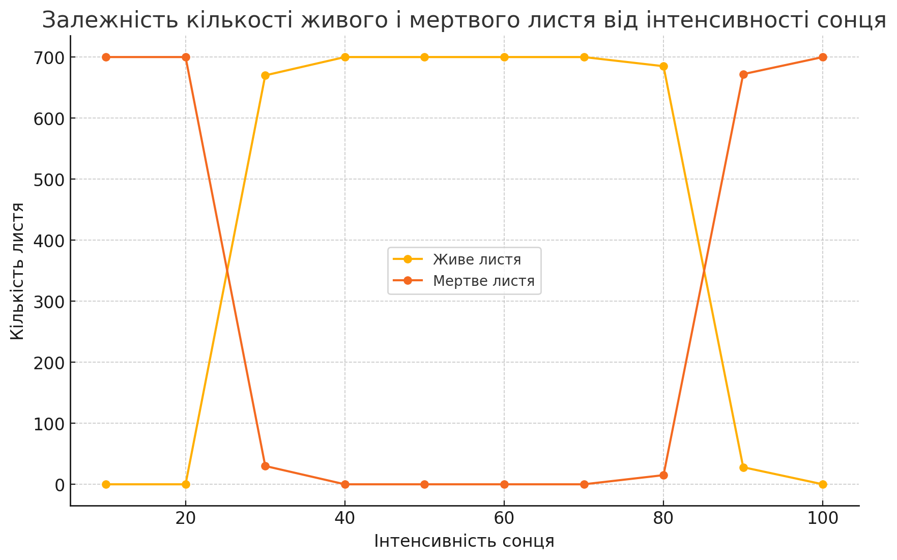
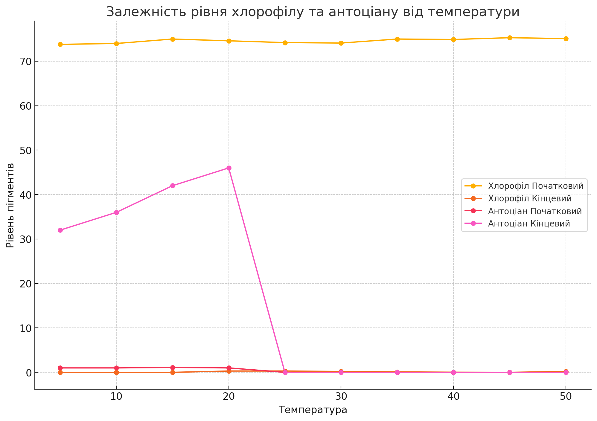

## Комп'ютерні системи імітаційного моделювання

## СПм-23-3, **Харахайчук Іван**

### Лабораторна робота **№1**. Опис імітаційних моделей та проведення обчислювальних експериментів

### Варіант 11, модель у середовищі NetLogo:

[Autumn](https://www.netlogoweb.org/launch#http://www.netlogoweb.org/assets/modelslib/Sample%20Models/Biology/Autumn.nlogo)

### Вербальний опис моделі:

Ця модель імітує зміну кольору та опадання листя на деревах протягом осіннього періоду. В умовах, де влітку теплий клімат, а взимку холодно, листя дерев змінює свої кольори перед опаданням. Модель надає можливість аналізувати цей процес щорічно, а також досліджувати вплив різних факторів, таких як температура, довжина дня та інші зовнішні й внутрішні чинники.

### Внутрішні параметри:

- **water-level** - показує рівень води в листі.
- **sugar-level** - відображає вміст цукру в листі.
- **attachedness** - визначає міцність прикріплення листа до гілки.
- **chlorophyll** - рівень хлорофілу, що надає зеленого забарвлення.
- **carotene** - рівень каротину, що надає жовтого кольору.
- **anthocyanin** - рівень антоціану, що надає червоного кольору.
- **location** - відображає розташування крапель дощу (“падає”, “у коренях”, “у стовбурі”, “у листі”).
- **amount-of-water** - кількість води в середовищі.
- **bottom-line** - рівень, що вказує на місцезнаходження поверхні землі.
- **evaporation-temp** - температура випаровування води.

### Керуючі параметри:

- **number-of-leaves** - цей параметр визначає, скільки листя буде на деревах на початку симуляції. За допомогою слайдера можна змінювати його значення, контролюючи кількість листя для симуляції.
- **start-sugar-mean** - вказує середнє значення вмісту цукру в листі.
- **start-sugar-stddev** - вказує температуру навколишнього середовища.
- **temperature** - цей параметр вказує, на температуру навколишнього середовища.
- **rain-intensity** - регулює інтенсивність опадів.
- **wind-factor** - задає силу вітру.
- **sun-intensity** - вказує на рівень сонячної активності.

### Показники роботи системи:

- **Leaves**: графік, що показує кількість живих і опалих листків.
- **Weather conditions**: графік, що ілюструє погодні умови, такі як дощ, сонячна активність, температура та вітер.
- **Leaf averages**: графік, що демонструє середні значення для хлорофілу, води, цукру, каротину, антоціану і показника міцності прикріплення листя.

### Примітки:

- Даний проект показує, що на процес опадання листя впливає безліч факторів: вміст цукру, сила вітру, інтенсивність сонця, дощ.
- При середньому рівні сонця та низькій температурі, листя залишається на деревах довше, оскільки сонячне світло важливе в цьому процесі.

### Недоліки моделі:

- Листя жовтіє рівномірно, хоча зазвичай першими жовтіють зовнішні листки.
- Дощ не впливає на швидкість опадання листя, хоча в реальності краплі можуть прискорити цей процес.
- При повній відсутності вітру листя практично не опадає.

## Обчислювальні експерименти

### 1. Вплив інтенсивності сонця на впадання листя

Досліджується залежність впливу сонця на випадання листя через 50 тактів.
Експерименти проводяться при 10-100 % інтенсивності сонця, з кроком 10, усього 10 симуляцій.  
Інші керуючі параметри мають значення за замовчуванням:

- **number-of-leaves**: 700
- **start-sugar-mean**: 40
- **start-sugar-stddev**: 15
- **temperature**: 20
- **rain-intensity**: 12
- **wind-factor**: 6

<table>
<thead>
<tr><th>Інтенсивність сонця</th><th>Живе листя</th><th>Мертве листя</th></tr>
</thead>
<tbody>
<tr><td>10</td><td>0</td><td>700</td></tr>
<tr><td>20</td><td>0</td><td>700</td></tr>
<tr><td>30</td><td>670</td><td>30</td></tr>
<tr><td>40</td><td>700</td><td>0</td></tr>
<tr><td>50</td><td>700</td><td>0</td></tr>
<tr><td>60</td><td>700</td><td>0</td></tr>
<tr><td>70</td><td>700</td><td>0</td></tr>
<tr><td>80</td><td>685</td><td>15</td></tr>
<tr><td>90</td><td>28</td><td>672</td></tr>
<tr><td>100</td><td>0</td><td>700</td></tr>
</tbody>
</table>

Висновки експерименту:

- Листя дуже чутливе до інтенсивності сонця, сонця впливає одразу на те, щоб листя заливалось живим та на те, щоб листя ставало жовтим та померло скоріше
- При інтенсивності 10-20 % листю не достатньо сонця та померле дуже швидко.
- При інтенсивності 30-80 % листю достатньо сонця та процес помирання листя проходить повільно.
- При інтенсивності 90-100 % листю забагато сонця та процес помирання листя дуже швидко, але повільніше ніж при не достачі сонця.

### 2. Вплив змісту цукру на показники Хлорофілу(зелений кольор), Каротину(жовтий кольор) та Антоціану(червоний кольор) в змісті листя

Досліджується залежність змісту цукру на показники Хлорофілу, Каротину та Антоціану в змісті листя (зміну кольору листя) за 75 тактів.
Експерименти проводяться при 10 - 100 % змісту цукру, з кроком 10, усього 10 симуляцій.  
Інші керуючі параметри мають значення за замовчуванням:

- **number-of-leaves**: 700
- **start-sugar-stddev**: 20
- **temperature**: 15
- **rain-intensity**: 15
- **wind-factor**: 4
- **sun-intensity**: 85

<table>
<thead>
<tr><th>Вміст Цукру</th><th>Хлорофіл Початковий</th><th>Хлорофіл Кінцевий</th><th>Каротин Початковий</th><th>Каротин Кінцевий</th><th>Антоціан Початковий</th><th>Антоціан Кінцевий</th></tr>
</thead>
<tbody>
<tr><td>10</td><td>74.3</td><td>0</td><td>50.79</td><td>73.5</td><td>0.63</td><td>29.1</td></tr>
<tr><td>20</td><td>74.2</td><td>0</td><td>49.8</td><td>45.2</td><td>0.78</td><td>11.7</td></tr>
<tr><td>30</td><td>74.3</td><td>0</td><td>47.5</td><td>18</td><td>0.9</td><td>41</td></tr>
<tr><td>40</td><td>75.2</td><td>0</td><td>49.7</td><td>64</td><td>0.95</td><td>40</td></tr>
<tr><td>50</td><td>74.5</td><td>0</td><td>49.1</td><td>83</td><td>0.97</td><td>36.9</td></tr>
<tr><td>60</td><td>74.3</td><td>0</td><td>52.1</td><td>67</td><td>1</td><td>40.2</td></tr>
<tr><td>70</td><td>74</td><td>0</td><td>51.2</td><td>76</td><td>1</td><td>42</td></tr>
<tr><td>80</td><td>73.6</td><td>0</td><td>49</td><td>47</td><td>1</td><td>41.5</td></tr>
<tr><td>90</td><td>74.9</td><td>0</td><td>50.6</td><td>90</td><td>1</td><td>38.7</td></tr>
<tr><td>100</td><td>73.9</td><td>0</td><td>47.7</td><td>32</td><td>1</td><td>41</td></tr>
</tbody>
</table>

Висновки експерименту:

- Збільшення змісту цукру не впливає на те, що листя може залишитися зеленуватим.
- Збільшення змісту цукру приводило до того, що зміст каротину та антоціану збільшувався, листя починало приймати жовто-червоний окрас раніше та більше.
- Каротин змінювався не поступово, значення мали велику розбіжність 

### 3. Вплив температури на показники Антоціану та Хлорофіл в змісті листя

Досліджується вплив температури на склад листя через 50 тактів.
Експерименти проводяться при температурах від 5 до 50 °C, з кроком 5, усього 10 симуляцій.
Інші керуючі параметри встановлено за замовчуванням:

- **number-of-leaves**: 700
- **start-sugar-mean**: 40
- **start-sugar-stddev**: 30
- **rain-intensity**: 12
- **wind-factor**: 4
- **sun-intensity**: 80

<table>
<thead>
<tr><th>Температура</th><th>Хлорофіл Початковий</th><th>Хлорофіл Кінцевий</th><th>Антоціан Початковий</th><th>Антоціан Кінцевий</th></tr>
</thead>
<tbody>
<tr><td>5</td><td>73.8</td><td>0</td><td>1</td><td>32</td></tr>
<tr><td>10</td><td>74</td><td>0</td><td>1</td><td>36</td></tr>
<tr><td>15</td><td>75</td><td>0</td><td>1.1</td><td>42</td></tr>
<tr><td>20</td><td>74.6</td><td>0.3</td><td>1</td><td>46</td></tr>
<tr><td>25</td><td>74.2</td><td>0.3</td><td>0</td><td>0</td></tr>
<tr><td>30</td><td>74.1</td><td>0.2</td><td>0</td><td>0</td></tr>
<tr><td>35</td><td>75</td><td>0.1</td><td>0</td><td>0</td></tr>
<tr><td>40</td><td>74.9</td><td>0.03</td><td>0</td><td>0</td></tr>
<tr><td>45</td><td>75.3</td><td>0</td><td>0</td><td>0</td></tr>
<tr><td>50</td><td>75.1</td><td>0.2</td><td>0</td><td>0</td></tr>
</tbody>
</table>

Висновки експерименту:

- Зі збільшенням температури частина хлорофілу постійно зростала поступово, але кінцеві значення мали маленьку різницю та зростали також в залежності від температури
- [5-20] °C - значення як початкового, так і кінцевого хлорофілу поступово зростає
- Після певної межі у 25°C значення відсутні як на початку, так і наприкінці симуляції