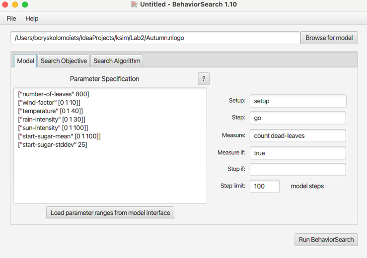
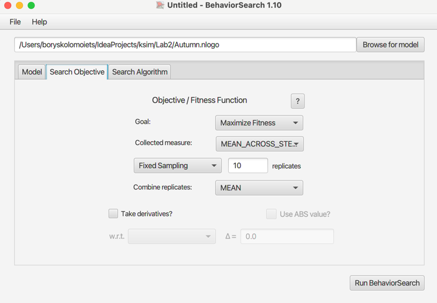
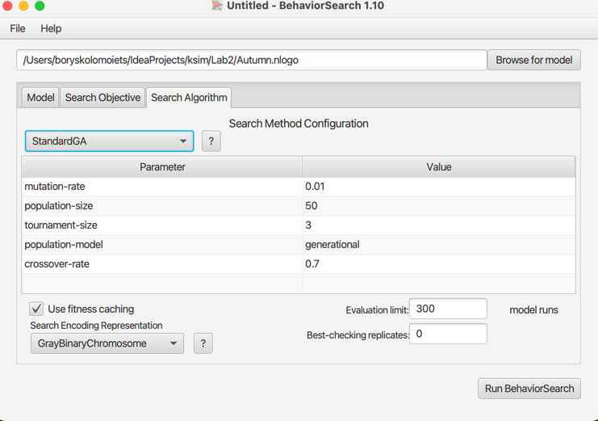
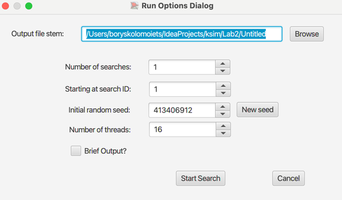
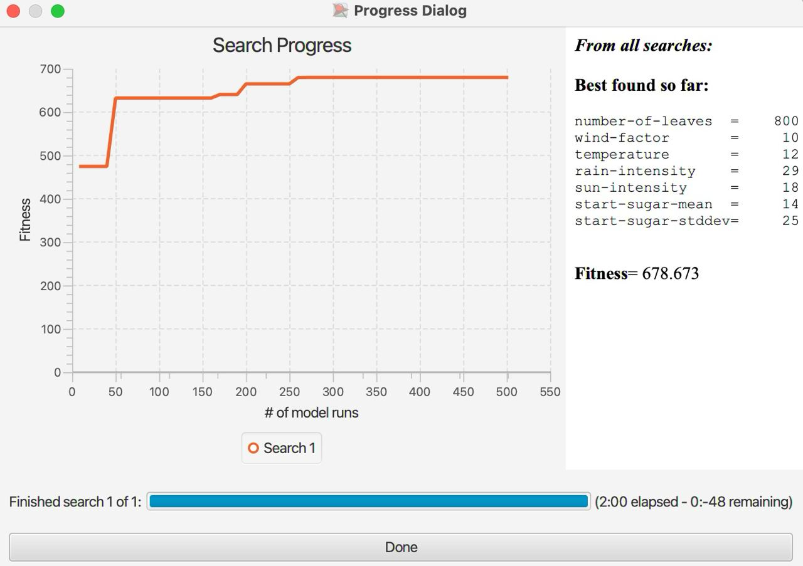
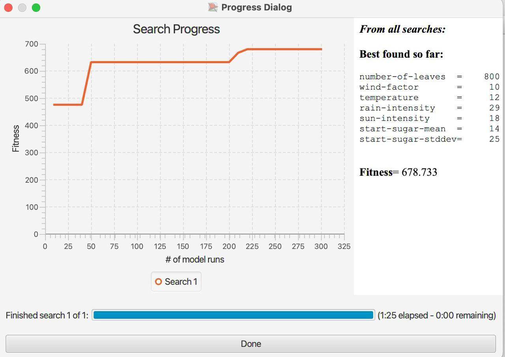

## Комп'ютерні системи імітаційного моделювання

## СПм-23-3, **Харахайчук Іван**

### Лабораторна робота **№3**. Використання засобів обчислювального інтелекту для оптимізації імітаційних моделей

### Варіант 11, модель у середовищі NetLogo:

[Autumn](http://www.netlogoweb.org/launch#http://www.netlogoweb.org/assets/modelslib/Sample%20Models/Biology/Autumn.nlogo)

#### Вербальний опис моделі:

- **[Вербальний опис моделі лабораторна робота №1](https://github.com/Haraige/simulations_lbs/blob/main/Lab1/lab1.md)**

### Налаштування середовища BehaviorSearch:

**Обрана модель**:
/Lab2/Autumn.nlogo

**Параметри моделі** (вкладка Model):

<pre>
["number-of-leaves" 800]
["wind-factor" [0 1 10]]
["temperature" [0 1 40]]
["rain-intensity" [0 1 30]]
["sun-intensity" [0 1 100]]
["start-sugar-mean" [0 1 100]]
["start-sugar-stddev" 25]
</pre>

number-of-leaves було встановлено в значення 800 та start-sugar-stddev у значення 25. Для спрощення виконання алгоритмів.

**Використовувана міра**:  
Для фітнес-функції було обрано **кількість мертвого листя** враховуючи багато факторів впливу на то, з якою швидкістю помре листя.

<pre>count dead-leaves</pre>

За цим показником можна спостерігати, при яких значеннях ефективність випадання листя буде найсильнішим.

Ефективність випадання листя повинна враховуватися **в середньому** за весь період симуляції тривалістю 100 тактів (адже на кожному такті є своя кількість мертвого листя),
починаючи з 0 такту симуляції.

Параметр зупинки за умовою (**Stop if**) не використовувався.

**Загальний вигляд вкладки налаштувань параметрів моделі:**  

**Налаштування цільової функції** (вкладка Search Objective):  

Метою вибору параметрів для показника **count dead-leaves** є ефективністю впливу природних факторів на показники метвого листя "**Goal**" зі значенням 
**Maximize Fitness**. Іншими словами, завданням є знаходження таких параметрів, за яких досягається найвищий показник мертвого листя. При цьому цікавить результат не у
якийсь окремий момент симуляції, а середнє її значення за всю симуляцію (тривалість якої 100 тактів).
*Collected measure**", що визначає спосіб обліку значень обраного показника, вказано **MEAN_ACROSS_STEPS**.  
Щоб уникнути викривлення результатів через випадкові значення, що використовуються в логіці самої імітаційної моделі, **кожна симуляція повторюється по 10 разів**,
результівне значення розраховується як **середнє арифметичне**.
Загальний вигляд вкладки налаштувань цільової функції:  

**Налаштування алгоритму пошуку** (вкладка Search Algorithm):

**Загальний вид вкладки налаштувань алгоритму пошуку:**

### Результати використання BehaviorSearch:

**Діалогове вікно запуску пошуку:**  

**Результати пошуку параметрів імітаційної моделі з використанням генетичного алгоритму:**

**Результат пошуку параметрів імітаційної моделі, використовуючи випадковий пошук:**  

- У данній лабораторній роботі я дослідив використання засобів обчислювального интелекту для оптимізації імітаційних моделей у програмі BehaviorSearch.
- Провів 2 дослідження за допомогою генетичного алгоритму та випадкового пошуку. Алгоритм випадкового пошуку виявився ефективнішим у цьому випадку на (35 сек).
